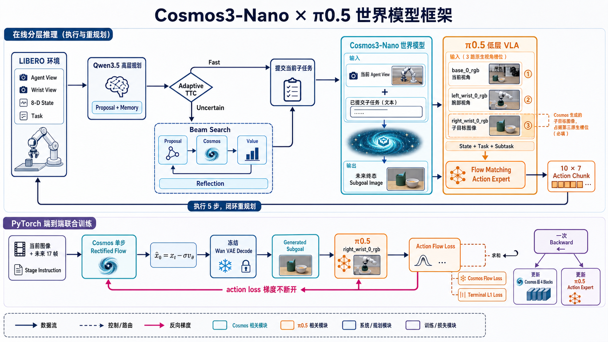
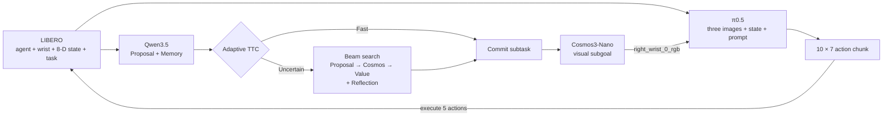
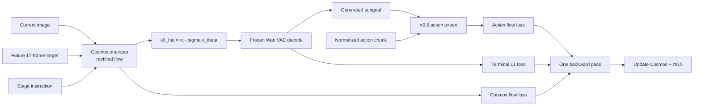

# Cosmos3-Nano × π0.5 World Model

An experimental hierarchical world-model policy for long-horizon robot manipulation. The system combines
**Qwen3.5** planning, adaptive test-time computation, **Cosmos3-Nano** visual subgoal generation, and the official
**openpi π0.5** action policy. It also includes a true PyTorch co-training path in which the π0.5 action loss
backpropagates through the generated subgoal image into Cosmos.

> **Release status:** this repository currently releases the implementation and training recipes. Model checkpoints
> and a statistically meaningful final LIBERO-Long score are not released yet. See [Results](#results-and-status) for
> the evidence available today.

<p align="center">
  
</p>

## What is implemented

- A memory-augmented Qwen3.5 planner with Proposal, Value, and Reflection roles.
- An adaptive TTC router: confident proposals take the fast path; uncertain proposals enter global beam search.
- Mandatory Cosmos3-Nano visual-subgoal generation for every committed subtask. There is no text-only fallback.
- Native three-image π0.5 conditioning:

  ```text
  base_0_rgb        = current agent view
  left_wrist_0_rgb  = current wrist view
  right_wrist_0_rgb = Cosmos-generated subgoal image
  ```

- A `10 × 7` LIBERO action chunk with five-step receding-horizon execution.
- Conversion of all ten LIBERO-Long tasks into semantic-stage LeRobot episodes.
- Standalone π0.5 visual-subgoal training, standalone Cosmos I2V training, and alternating replay co-training.
- End-to-end PyTorch co-training on one autograd graph from Cosmos to π0.5.
- Isolated Qwen, Cosmos, policy, and LIBERO runtimes plus resumable `10 tasks × 50 episodes` evaluation.

## System overview

At control sequence `t`, the evaluator sends the two camera views, robot state, full task, episode ID, and sequence
ID. Qwen proposes an executable subtask and updates memory. Adaptive TTC either commits it immediately or invokes
beam search over repeated `Proposal → Cosmos → Value` branches followed by Reflection. Cosmos then generates the
near-future terminal image for the committed subtask. π0.5 consumes that image in its third native camera slot and
predicts the action chunk.



The high-level planner is refreshed every ten low-level queries by default. Between refreshes, π0.5 tracks the same
subgoal using fresh observations and state. Stale planner results are rejected by sequence ID.

## End-to-end co-training

The newest training path uses one PyTorch graph. Cosmos predicts a clean latent with a single sampled rectified-flow
step, the frozen Wan VAE decodes its terminal frame, and that tensor is inserted into π0.5 as
`right_wrist_0_rgb`—without `detach`, PIL, or NumPy conversion.



The objective is:

```text
L = 1.0 * L_action + 1.0 * L_cosmos_flow + 0.1 * L_terminal_L1
```

By default, training updates the last four Cosmos transformer blocks and the π0.5 action expert while freezing the
Wan VAE and the π0.5 SigLIP/PaliGemma backbone. Frozen modules remain in the differentiable input path. The logged
`bridge_grad` is the action branch's gradient norm on the generated image and provides a direct connectivity check.

Training uses the inexpensive one-step clean estimate only for backpropagation. Deployment still uses the standard
multi-step Cosmos sampler.

## Repository layout

```text
src/cosmos_pi05/high_level/       adaptive TTC, beam search, model clients, prompts, episode state
src/cosmos_pi05/hierarchical_policy.py
                                  high-level planner to low-level π0.5 wrapper
src/cosmos_pi05/cotrain/          differentiable Cosmos adapter, joint model, paired dataset
src/openpi/policies/libero_subgoal_policy.py
                                  LIBERO to native three-image π0.5 mapping
examples/libero/                  dataset conversion and resumable closed-loop evaluation
scripts/cosmos/                   Cosmos setup, training, export, and validation helpers
scripts/cotrain/                  replay and end-to-end co-training tools
scripts/services/                 resident Qwen and Cosmos services
```

## Requirements

- Ubuntu 22.04
- NVIDIA GPU(s) with CUDA 12 support
- Python 3.11 and [`uv`](https://docs.astral.sh/uv/)
- A separate Python 3.8 environment for the official LIBERO simulator
- Access to the required Qwen3.5, Cosmos3-Nano, Wan VAE, and π0.5 base checkpoints
- The LIBERO-Long demonstrations for training or closed-loop evaluation

The reference end-to-end run used eight H200 GPUs. With 17 frames at 256 px, local batch 8 peaked at approximately
121 GiB per GPU. Start with local batch 1 on smaller accelerators; inference and standalone π0.5 training have much
lower requirements.

## Installation

Clone with submodules and install the base openpi environment:

```bash
git clone --recurse-submodules https://github.com/yizhiqianbi/cosmos-pi05-world-model.git
cd cosmos-pi05-world-model

GIT_LFS_SKIP_SMUDGE=1 uv sync
GIT_LFS_SKIP_SMUDGE=1 uv pip install -e .
```

The services intentionally use separate environments because their dependency stacks conflict:

```bash
scripts/setup_qwen_env.sh
scripts/cosmos/setup_cosmos_framework.sh
scripts/setup_libero_eval_env.sh
scripts/cotrain/setup_torch_e2e_env.sh       # only needed for joint PyTorch training
```

## Prepare LIBERO-Long data

For VLM-derived semantic boundaries, use the auditable open-weight model pipeline in
[`docs/vlm_subtask_pipeline.md`](docs/vlm_subtask_pipeline.md). The converter below retains the original deterministic
task-specific segmentation path.

Convert all ten task files. Each semantic stage becomes its own episode and every frame is paired with that stage's
terminal agent-view image:

```bash
export HF_LEROBOT_HOME=/path/to/lerobot-home

uv run examples/libero/convert_long_hdf5_to_lerobot.py \
  --input-dir /path/to/libero_10 \
  --repo-id hubin/libero_long_subgoal
```

The matching π0.5 config is `pi05_libero_long_subgoal`. See
[`docs/cosmos_pi05_architecture.md`](docs/cosmos_pi05_architecture.md) for the stage and observation contracts.

## Training

### 1. Standalone π0.5 visual-goal policy

The launcher computes exactly five epochs from the LeRobot metadata, calculates normalization statistics, and starts
from the official π0.5 base parameters:

```bash
export HF_LEROBOT_HOME=/path/to/lerobot-home
CUDA_VISIBLE_DEVICES=0,1,2,3,4,5,6,7 \
  BATCH_SIZE=256 scripts/train_pi05_libero_long_5ep.sh
```

### 2. Standalone Cosmos subgoal model

Materialize the stage-video dataset described in [`docs/cotrain.md`](docs/cotrain.md), then run:

```bash
export COSMOS_FRAMEWORK_DIR=/path/to/cosmos-framework
export COSMOS_DATASET=/path/to/libero_cosmos_stage_dataset
export COSMOS_BASE_SNAPSHOT=/path/to/Cosmos3-Nano
export WAN_VAE_PATH=/path/to/Wan2.2_VAE.pth
export COSMOS_OUTPUT_ROOT=/path/to/cosmos-runs

COSMOS_GPUS=0,1,2,3 scripts/train_cosmos_subgoal.sh
```

### 3. True end-to-end PyTorch co-training

First export the completed Cosmos run and convert the completed π0.5 JAX checkpoint:

```bash
scripts/cotrain/prepare_torch_e2e_checkpoints.sh \
  /path/to/cosmos-framework \
  /path/to/completed-cosmos-run \
  /path/to/pi05-jax-checkpoint \
  "$PWD/artifacts/torch_e2e"
```

Launch distributed training:

```bash
export COSMOS_CHECKPOINT="$PWD/artifacts/torch_e2e/cosmos3_nano_diffusers"
export PI_CHECKPOINT="$PWD/artifacts/torch_e2e/pi05_torch"
export OUTPUT_DIR="$PWD/checkpoints/torch_e2e_cosmos_pi05_5ep"

scripts/cotrain_cosmos_pi05_e2e_torch.sh
```

Run a real forward/backward smoke test before a long job:

```bash
LOCAL_BATCH_SIZE=1 OUTPUT_DIR="$PWD/checkpoints/torch_e2e_smoke" \
  scripts/cotrain_cosmos_pi05_e2e_torch.sh --max-steps 1 --save-interval 1
```

Resume with `--resume`. Export a merged inference pair after training:

```bash
.venv-e2e/bin/python scripts/cotrain/export_torch_end_to_end.py \
  --cosmos-checkpoint "$COSMOS_CHECKPOINT" \
  --pi-checkpoint "$PI_CHECKPOINT" \
  --adapter-checkpoint "$OUTPUT_DIR/step_00009825" \
  --output-dir artifacts/torch_e2e_merged
```

For the complete dataset mapping, memory measurements, parameter freeze policy, and validation checklist, see the
[`PyTorch end-to-end co-training guide`](docs/torch_end_to_end_cotrain.md).

## Serve and evaluate

Set the external checkpoint paths and start all three model services:

```bash
export QWEN_BASE=/path/to/Qwen3.5-9B
export QWEN_ADAPTER_ROOT=/path/to/proposal-value-reflection-adapters
export COSMOS_MODEL=/path/to/Cosmos3-Nano-or-merged-export
export PI05_CHECKPOINT=/path/to/pi05-checkpoint

scripts/run_hierarchical_stack.sh
```

In another terminal, run one reproducible smoke episode:

```bash
scripts/run_libero_eval.sh \
  --task-id 0 \
  --first-episode 0 \
  --num-trials-per-task 1 \
  --output-dir outputs/libero_long_smoke
```

Run the complete official-style protocol:

```bash
scripts/run_libero_eval.sh \
  --num-trials-per-task 50 \
  --output-dir outputs/libero_long_500ep
```

Evaluation is resumable and writes one JSON record per episode, subgoal images, optional videos, and an aggregate
summary. The complete protocol is 10 tasks × 50 initial states.

## Results and status

The code paths, data conversion, training launchers, service stack, and evaluator are implemented and unit-tested.
The following local engineering runs informed this release:

| Run | Observation |
|---|---|
| Standalone π0.5 visual-subgoal training, 5 epochs | training loss decreased from `0.0775` to `0.0051` |
| End-to-end Cosmos × π0.5 training, 5 epochs | completed `9,825 / 9,825` optimizer steps |
| Joint gradient diagnostic | finite, non-zero `bridge_grad`, confirming the action loss reaches Cosmos |
| Pre-co-training A/B smoke test | native π0.5: `1/1`; unadapted Cosmos path: `0/1` |

The A/B test is an engineering smoke test on one task and one initial state—not a benchmark result. It was run before
the final joint checkpoint and showed the expected bootstrap failure: the unadapted Cosmos output mostly preserved
the current observation instead of producing a completed subtask state. The report and artifacts are documented in
[`docs/libero_long_ab_20260812.md`](docs/libero_long_ab_20260812.md).

No success rate is claimed for the final end-to-end checkpoint until it has been exported and evaluated across the
full protocol. Checkpoints, datasets, training logs, and local environments are intentionally excluded from Git.

## Tests

Run the focused project tests:

```bash
uv run pytest -q \
  src/cosmos_pi05 \
  src/openpi/policies/libero_subgoal_policy_test.py \
  scripts/cotrain

uv run ruff check src/cosmos_pi05 scripts/cotrain
```

Some integration and GPU tests require the corresponding model checkpoints and isolated environments.

## Documentation

- [Architecture and runtime contracts](docs/cosmos_pi05_architecture.md)
- [End-to-end PyTorch co-training](docs/torch_end_to_end_cotrain.md)
- [Standalone and alternating co-training](docs/cotrain.md)
- [LIBERO-Long A/B engineering report](docs/libero_long_ab_20260812.md)
- [Remote inference](docs/remote_inference.md)
- [Docker notes](docs/docker.md)

## Acknowledgements and license

This project is built on the official [Physical Intelligence openpi](https://github.com/Physical-Intelligence/openpi)
implementation, [NVIDIA Cosmos](https://github.com/NVIDIA/cosmos),
[Cosmos Framework](https://github.com/NVIDIA/cosmos-framework), and
[LIBERO](https://github.com/Lifelong-Robot-Learning/LIBERO). It is a research integration and is not an official
release from those projects.

The repository retains the upstream Apache 2.0 license and bundled third-party notices. Model checkpoints and
datasets may have separate licenses; review their terms before downloading, training, or redistribution.
