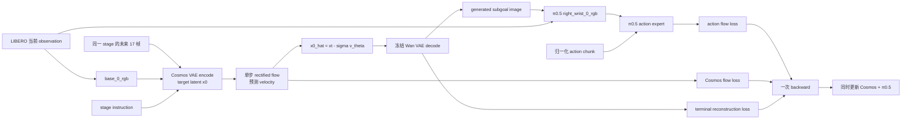

# Cosmos3-Nano + π0.5 PyTorch 端到端联合训练

这版是同一张 PyTorch autograd graph 上的真正 co-training，不是此前的交替 replay 训练。Cosmos 预测的 clean latent 经冻结的 Wan VAE 解码后，直接作为张量写入 π0.5 的第三图像槽；π0.5 action flow-matching loss 会沿这条路径反传到 Cosmos。



## 训练目标

每个 LIBERO 时刻使用三部分监督：

```text
L = 1.0 * L_action + 1.0 * L_cosmos_flow + 0.1 * L_terminal_L1
```

- `L_action`：π0.5 的 action rectified-flow MSE。
- `L_cosmos_flow`：Cosmos 在随机 Waver sigma 上的 velocity MSE。
- `L_terminal_L1`：预测 terminal subgoal 与演示 terminal frame 的 L1。

训练时不展开完整 35-step denoising，因为那会保留 35 份巨大的反向图。这里随机采一个标准噪声时刻，只做一次 velocity forward，再用 `x0_hat = xt - sigma * v` 得到可微 clean estimate。正式推理仍然使用 Cosmos 的标准 35-step sampler。

默认前 500 个 optimizer step 将生成 subgoal 的占比从 0.25 线性升到 1.0：

```text
policy_subgoal = mix * generated + (1 - mix) * oracle
```

这不是切断梯度的 teacher forcing；只要 `mix > 0`，action loss 就能更新 Cosmos。日志中的 `bridge_grad` 是 action 分支在生成图上的梯度范数，可直接验证桥是否连通。

## 数据对应关系

- LeRobot：`hubin/libero_long_subgoal`，1750 个 semantic-stage episode，138090 帧。
- Cosmos：train 1596 stages、val 154 stages，总数也是 1750。
- UUID `episode_{task}_{demo}_stage_{stage}` 排序后与 LeRobot episode index 一一对应。
- 当前 train split 实际产生 125766 个时刻样本。
- π0.5 输入为三张 224×224 图：agent view、wrist view、subgoal image。
- Cosmos target 从当前 stage progress 开始，均匀取到 terminal 的 17 张 256×256 图；第一帧强制替换成当前 agent observation，作为 I2V condition。
- state/actions 使用现有 `pi05_libero_long_subgoal` 的 quantile normalization，action chunk 是 10×32，其中 LIBERO 原始 7D action 被 pad 到模型宽度。

## 参数更新范围

H200 默认设置兼顾显存与可训练性：

- Cosmos：最后 4 个 transformer blocks、generation norm、vision output head。
- π0.5：300M action expert、action input/output heads、time MLP。
- 冻结：Cosmos Wan VAE、Cosmos 前 32 blocks、π0.5 SigLIP/PaliGemma 主干。

冻结不等于断图。Wan decoder 和 SigLIP 的参数没有 optimizer state，但其算子仍保留对输入的梯度，因此 action loss 能经过 decoder 和视觉编码器回到 Cosmos。要全量更新 π0.5，可传 `--pi-trainable all`；要增加 Cosmos 容量，可调大 `COSMOS_TRAINABLE_BLOCKS`。

## 1. 建立隔离环境

Cosmos Diffusers 需要 `diffusers==0.39.0`，而 π0.5 需要仓库定制的 `transformers==4.53.2`。不要改坏已有的 JAX 或 Cosmos framework 环境：

```bash
cd /public/interns/hubin/world_models/models/cosmos-pi05-world-model
scripts/cotrain/setup_torch_e2e_env.sh
```

脚本创建 `.venv-e2e`，安装项目的 `e2e` extra，并自动安装 OpenPI 的 Transformers replacement。

## 2. 准备两个 Torch 基座

```bash
scripts/cotrain/prepare_torch_e2e_checkpoints.sh \
  /public/interns/hubin/world_models/src/cosmos-framework \
  /public/interns/hubin/world_models/models/libero-data/checkpoints/libero_cosmos_long_full_500iter/cosmos3/sft/cosmos_pi05_long_i2v_500iter \
  /public/interns/hubin/world_models/models/cosmos-pi05-world-model/checkpoints/pi05_libero_long_subgoal/pi05_libero_long_subgoal_5ep/2699 \
  /public/interns/hubin/world_models/models/cosmos-pi05-world-model/artifacts/torch_e2e
```

输出：

```text
artifacts/torch_e2e/
├── cosmos3_nano_diffusers -> <Cosmos run>/diffusers
└── pi05_torch/
    └── model.safetensors
```

Cosmos 使用已经完成 500 iter 的 LIBERO Long I2V checkpoint；π0.5 使用已经完成 5 epoch 的 LIBERO Long subgoal checkpoint。转换不会覆盖原 checkpoint。

## 3. 启动 8 卡、5 epoch 联合训练

```bash
export COSMOS_CHECKPOINT=$PWD/artifacts/torch_e2e/cosmos3_nano_diffusers
export PI_CHECKPOINT=$PWD/artifacts/torch_e2e/pi05_torch
export OUTPUT_DIR=$PWD/checkpoints/torch_e2e_cosmos_pi05_5ep

scripts/cotrain_cosmos_pi05_e2e_torch.sh
```

首次部署建议先做一个真实 forward/backward 冒烟：

```bash
OUTPUT_DIR=$PWD/checkpoints/torch_e2e_smoke \
  scripts/cotrain_cosmos_pi05_e2e_torch.sh --max-steps 1 --save-interval 1
```

经过 H200 实测，默认每卡 batch 8、8 卡、无需梯度累积，所以 global batch 是 64：

```text
global batch = 8 × 8 GPUs × 1 accumulation = 64
```

真实联合 forward/backward/optimizer step 的峰值为 113.8 GiB/卡，低于 H200 的 141 GiB。batch 1 和 2 的实测峰值分别为 50.1 和 59.2 GiB；batch 8 保留约 27 GiB 余量，因此不继续冒险上调。其他 GPU 应先用 `LOCAL_BATCH_SIZE=1 GRADIENT_ACCUMULATION_STEPS=8`。不要只看模型加载后的显存决定 batch；Cosmos decoder、π0.5 三图 SigLIP 和 backward 峰值会更晚出现。

断点恢复：

```bash
scripts/cotrain_cosmos_pi05_e2e_torch.sh --resume
```

每个 checkpoint 保存 `trainable.safetensors`、optimizer state、step/epoch 和完整参数。冻结基座不重复保存，因此断点体积远小于两份完整模型。

## 4. 导出完整推理权重

```bash
.venv-e2e/bin/python scripts/cotrain/export_torch_end_to_end.py \
  --cosmos-checkpoint "$COSMOS_CHECKPOINT" \
  --pi-checkpoint "$PI_CHECKPOINT" \
  --adapter-checkpoint "$OUTPUT_DIR/step_00000250" \
  --output-dir artifacts/torch_e2e_merged_step250
```

导出目录含完整 `cosmos3_nano/` Diffusers 权重和 `pi05/model.safetensors`。推理时 Cosmos 用标准 35 denoising steps 生成 terminal image，再将其作为 `right_wrist_0_rgb` 交给 π0.5；不使用训练时的一步 `x0_hat` 快捷路径。

## 核心实现位置

- `src/cosmos_pi05/cotrain/cosmos_diffusers.py`：可微单步 Cosmos I2V。
- `src/cosmos_pi05/cotrain/torch_joint.py`：subgoal tensor 注入和联合 loss。
- `src/cosmos_pi05/cotrain/libero_joint_dataset.py`：LIBERO/LeRobot/Cosmos stage 配对。
- `scripts/cotrain/train_torch_end_to_end.py`：DDP、梯度累积、双学习率、保存/恢复。
- `scripts/cotrain_cosmos_pi05_e2e_torch.sh`：8 卡启动器。

## 判断是否真正在 co-train

启动后同时检查：

1. `action`、`wm`、`recon` 三个 loss 都是有限值。
2. `bridge_grad` 非零且有限；这证明 action loss 对 generated subgoal 有梯度。
3. 日志打印的 Cosmos 和 π0.5 trainable parameter 数均大于零。
4. `trainable.safetensors` 同时包含 `world_model.*` 和 `policy.*` key。

如果 `bridge_grad=0`，首先检查 `generated_subgoal_start` 是否被设为 0；如果 OOM，依次减小 local batch、Cosmos trainable blocks、video frames，最后才降低分辨率。
